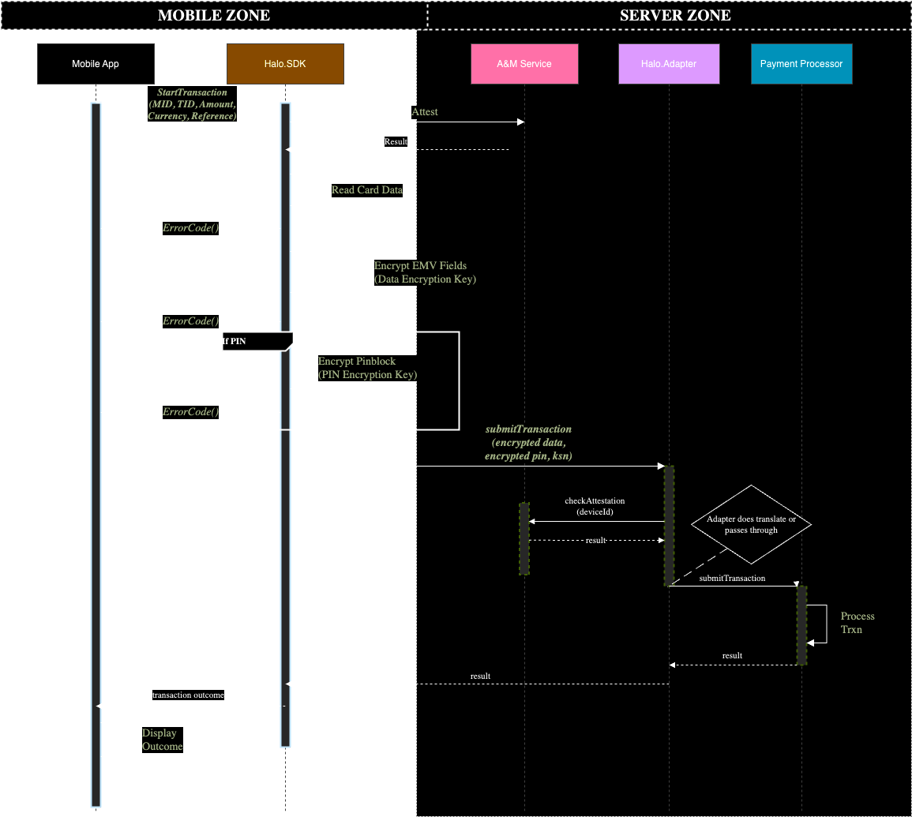

# Design Specification

## 1. Introduction

### 1.1 Purpose

Provide a comprehensive design specification for the integration of the Halo Dot SDK with the new Adapter, which will be deployed in the acquirer/PSP backend environment.

#### **1.2 Scope**

* This document covers the integration requirements, design, functional flow, technical specifications, and deployment process for the Adapter.

#### **1.3 Audience**

* This document is intended for developers, system architects, integration engineers, and stakeholders involved in the implementation of the Halo Dot SDK and Adapter.

## **2. Background**

### **2.1 Overview of Tap on Phone (ToP)**

* Introduced in 2019 as an experimental product.
* Initial product stacks replicated capabilities inherent in acquiring platforms.
* Current challenges with scaling due to duplicated systems.

Many of our customers, feel that SoftPOS is becoming an increasingly important part of their terminal estates.

However, they felt that operating SoftPOS in isolation is neither optimal nor sustainable as the sector grows. A new approach to managing this expansion effectively was needed.

Together, we identified significant redundancies between the SoftPOS vendors' backend systems and the acquiring platforms, particularly with functions like onboarding (MID/TID), terminal management, transaction management, key management, and fraud processing.

Our goal was to streamline operations and improve efficiencies by eliminating this duplication, leveraging your existing acquiring platform's capabilities.

### **2.2 Problem Statement**

* Acquirers have integrated ToP product stacks that replicate existing capabilities in their acquiring platforms, creating operational inefficiencies.

### **2.3 Vision**

* The Halo Dot Adapter will integrate seamlessly with existing systems, maintaining PCI security and transaction capture without duplicating existing capabilities.

## **3. Current System Design**

### **3.1 Existing Tap on Phone Architecture**

<figure><figcaption></figcaption></figure>

*   **Overview of the current SDK/Backend capabilities.**

    * Terminal Management: Deliver terminal config (limits, keys and other parameters)
    * Transactions: Submit MID, TID, Amount, Currency, Reference with the Track 2 card data, discretionary data, and EMV tags, and transmit them to the payment processor via a REST API.
    * Key Management:

    &#x20;    1\) Derive a session key (using ECDH) that is used to transport an IPEK to the device

    &#x20;    2\) Generate IPEK, export under session key

    * Attestation and Monitoring: Processes a number of checks to attest the integrity of the app, system and device rendering it fit for secure payment card processing and handling of card holder data.
* **Explanation of current integration methods with acquirers.**
  * Transactions: JSON to a rest endpoint
  * Terminal Config: Shared out of band
  * Terminal Binding: JSON to a rest endpoint
  * HSM: Key Ceremony between Acquirer/PSP and Halo Dot to establish trusted zone which allows for translation of PIN blocks and Track 2.

### **3.2 Challenges/ Limitations**

* Vendor systems are isolated from acquirers’ capabilities
* Key ceremony required between SoftPOS vendor to translate PIN blocks and Track2
* Terminal config must be manually configured on both Terminal Management (TMS) systems and coordinated through various email/calls
* <mark style="color:red;">Telemetry/ Debugging: No direct access to system level logs would need to be provided by 3rd party</mark>
* <mark style="color:red;">Support: Managed by 3rd party (SoftPOS provider)</mark>

<mark style="color:red;">Undermines the autonomy of the PSP it has to be in control of the services. 3rd parties blur these lines. (where makes sense for example A\&M makes sense cause of compliance)</mark>

<mark style="color:red;">Don’t want to be an on seller want to be a provider</mark>

## **4. New Solution Design**

### **4.1 Overview**

The adapter fulfils the role as an interface between the Halo Dot backend and your acquiring platform. Providing a scalable and resilient platform. The solution works **with** your acquiring platform as opposed to **beside** it.

<figure><figcaption></figcaption></figure>

### 2.2 Benefits

* Transactions are managed in the same manner as your existing POS devices (access to system level logs)
* Utilizes configurations from your existing TMS
* Uses your existing HSM and BDK to initialize the device
* Authentication and Monitoring (A\&M) for SoftPOS terminals are handled transparently

### **4.2 Functional Design**

* **4.2.1 Use Cases**
  * Detailed use cases for the Adapter integration.
*   **4.2.2 Functional Flow**

    * Diagrams and explanations of the functional flow between the Adapter, SDK, and acquirer backend.

1. Device Registration Flow&#x20;

<figure><figcaption></figcaption></figure>

#### Device Registration Sequence Diagram

<figure><figcaption></figcaption></figure>

### **Transaction flow**&#x20;

<figure><figcaption></figcaption></figure>

### Transaction Sequence Diagram

<figure><figcaption></figcaption></figure>

### **4.3 Technical Design**

* **4.3.1 Adapter Interface Requirements**
  * **Use Case/Function**: Explanation of why each interface is needed.
  * **Functional Flow**: Specific messages/requests implemented in each interface.

### **4.4 Interface Between Adapter and SDK**

* **Use Case/Function**
  * Explanation of the interaction between the Adapter and SDK.
* **Functional Flow**
  * Specific messages flowing between the Adapter and SDK for different purposes.
* **Configuration vs. Static Elements**
  * What will be configurable vs. set/static.

## **5. Deployment**

### **5.1 Deployment Overview**

* Steps required for deploying the Adapter in the acquirer/PSP backend environment.

### **5.2 Integration Process**

* Detailed instructions on the integration process with existing systems.

### **5.3 Testing and Validation**

* Procedures for testing the integration and validating the functionality.

## **6. Benefits of the New Solution**

* **6.1 Operational Efficiency**
  * Reduction of duplicate systems and streamlined operations.
* **6.2 Cost Savings**
  * Lower operational costs by leveraging existing acquirer systems.
* **6.3 Enhanced Security**
  * Maintaining PCI compliance and enhanced transaction security.

## **7. Conclusion**

#### **7.1 Summary**

* Recap of the benefits and importance of the new Adapter integration.

#### **7.2 Next Steps**

* Outline the next steps in the development and deployment process.
