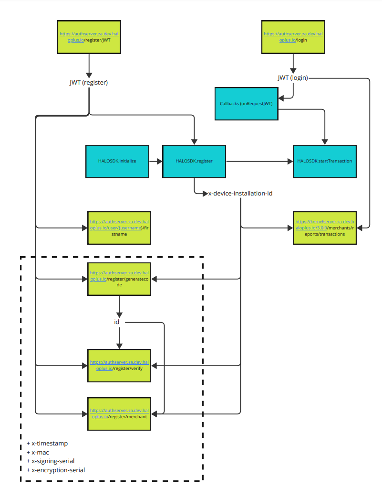

Basics of interacting with the Halo backend
===========================================

**A brief overview on working with the backend auth and kernel servers. Including some common errors and issues.**




# Decrypting JWEs

When interacting with the backend servers, include the x-device-installation-id header in the request. The response will be a JWE (JSON Web Encryption) that needs to be decrypted.

To decrypt the JWE, you will need a private key obtained from the keystore. Use the KEYSTORE_PROVIDER parameter set to "AndroidKeyStore" and the ENCRYPTION_KEY_ALIAS parameter set to "Halo-EncryptionKey" (password: null) to retrieve the private key.

```java
import com.nimbusds.jose.JWEObject;
import com.nimbusds.jose.crypto.RSADecrypter;

JWEObject jweObject = JWEObject.parse(jweString);
jweObject.decrypt(new RSADecrypter(privateKey));
JSONObject payload = jweObject.getPayload().toJSONObject();
```

# Signing Payloads

Before signing a payload, it must be converted to a byte array byte[] format.

To obtain the private key from the keystore, use the java.security.KeyStore class and set the KEYSTORE_PROVIDER parameter to "AndroidKeyStore". The private key alias SIGNING_KEY_ALIAS should be set to "Halo-SigningKey" with a null password. The private key can then be retrieved as a java.security.PrivateKey.

```java
import java.security.KeyStore;
import java.security.PrivateKey;

KeyStore keyStore = KeyStore.getInstance(KEYSTORE_PROVIDER);
keyStore.load(null);
PrivateKey privateKey = (PrivateKey) keyStore.getKey(SIGNING_KEY_ALIAS, null);
```

Next, use the java.security.Signature class to sign the payload with the algorithm SIGNATURE_ALG = "SHA256withRSA" and the private key obtained above.

```java
import java.security.Signature;

Signature signature = Signature.getInstance(SIGNATURE_ALG);
signature.initSign(privateKey);
signature.update(payload);
byte[] signedPayload = signature.sign();
```

The output will be a byte array, but it can be encoded to a string using Base64 encoding without any line breaks. Use Base64.NO_WRAP for this purpose.

```java
import android.util.Base64;

String encodedSignedPayload = Base64.encodeToString(signedPayload, Base64.NO_WRAP);
```

Note that the payload being signed is typically a concatenation of jwt + x-timestamp + payload from the HTTP(S) request. Make sure these parameters used to sign is the same as passed into the request.

# Auth Server Endpoints
`https://authserver.za.dev.haloplus.io/`


## Endpoint: /register/JWT
Obtain a JWT token used for future endpoints when registering and generating OTP codes, before logging in.

**Request**

Type: `GET`

Headers: `null`

Payload: `null`

**Response**

Status Code: `200`

Body:

```json
{ "token": "xxxxxx" }
```

## Endpoint: /user/{username}/firstname
Get the display name of the user. Note all the display names (first and last names) are stored in one field.

### Request

Type: `GET`

Headers:

```plaintext
"Authorization": "Bearer " + *jwtToken*
```

(Note the jwt from the /register/JWT endpoint is acceptable)

Payload: `null`

### Response

Status Code: `200`

Body:

```json
{ "name": "xxxxxx" }
```

## Endpoint: /register/generatecode

Generate an OTP sent to the user to verify their phone number or email.

**Request**

Type: POST

Headers:

- "Authorization": "Bearer " + *jwtToken*
- "x-device-installation-id": <installation_id>
- "x-timestamp": <timestamp>
    - SimpleDateFormat("yyyy-MM-dd'T'HH:mm:ss.SSSZ")
- "x-mac": <signature>
- "x-signing-serial": 
    - "Halo-ServerSigningCert"
- "x-encryption-serial": 
    - "Halo-ServerEncryptionCert"

Payload:
```json
{
    "address": <phoneNumber> (+27xxxxx) or <emailAddress>,
    "channel": "email" or "sms",
    "apkPackageName": "za.co.synthesis.halo.mpos.go",
    "addressCheck": <addressCheck>,
    "appSignature": <nameToBeDisplayedOnOTPMessage>
}
```

**Response**

Status Code: `200`

Body:
```json
{ "jwe": "xxxxxx" }
```

	= decrypted:
```json
{ "id": "xxxxx" }
```


## Endpoint: /register/verify

Generate a one-time password (OTP) and send it to the user to verify their phone number or email address.

### Request

Method: POST

Headers:

- Authorization: Bearer token obtained from jwtToken.
- x-device-installation-id: Obtained from HaloSDK.register.
- x-timestamp: Timestamp of the request in the format yyyy-MM-dd'T'HH:mm:ss.SSSZ.
- x-mac: A signature of the JWT token, timestamp, and payload using a secret key.
- x-signing-serial: The serial number of the server signing certificate.
- x-encryption-serial: The serial number of the server encryption certificate.

Body: A JSON object containing the following fields:

- address: The user's phone number (in the format +27xxxxx) or email address.
- channel: The communication channel to send the OTP. Valid values are "email" or "sms".
- id: The ID obtained from /register/generatecode.
- code: The OTP code as a string.

Example request body:

```json
{
  "address": "+27123456789",
  "channel": "sms",
  "id": "123456",
  "code": "123456"
}
```

### Response

Status code: 200

Body: A JSON object containing the following field:

- jwe: A JWE (JSON Web Encryption) token.

Example response body:

```json
{
  "jwe": "xxxxxx"
}
```

### Error Responses

If the request is unsuccessful, the endpoint may return one of the following HTTP status codes:

- 401 Unauthorized: Invalid JWT token.
- 422 Unprocessable Entity: Incorrect or missing request parameters.
- 500 Internal Server Error: An unexpected error occurred on the server.

In addition to the HTTP status code, an error response may contain a JSON object with the following field:
message: A human-readable error message.

Note: The payload of the decrypted JWT might be empty which indicates a successful code entry.


## Endpoint: /login
This endpoint is used to obtain a JWT token for authorization in future request headers.

### Request
Method: POST

Headers: None

Body: A JSON object containing the following fields:
```
username (string, case-sensitive)
password (string)
```

Example request body:
```json
{
    "username": "my_username",
    "password": "my_password"
}
```

### Response
Status code: 200

```
Body: A JSON object containing the following field:
token: a JWT token (string)
```

Example response body:
```json
{
    "token": "xxxxxx"
}
```


### Error Responses
If the request is unsuccessful, the endpoint may return one of the following HTTP status codes:

401 Unauthorized: Invalid credentials.

500 Internal Server Error: An unexpected error occurred on the server.

## Endpoint: /register/merchant
Register a new merchant.

### Request
Method: POST

Headers:

- "Authorization": "Bearer " + jwtToken
- "x-device-installation-id": 
    - obtained from HaloSDK.register
- "x-timestamp": 
    - SimpleDateFormat("yyyy-MM-dd'T'HH:mm:ss.SSSZ")
- "x-mac": 
    - Sign(jwtToken + x-timestamp + Payload)
- "x-signing-serial": 
    - KEY_SERVER_SIGNING_CERT = "Halo-ServerSigningCert" from KEYSTORE_PROVIDER = "AndroidKeyStore"
- "x-encryption-serial": 
    - KEY_SERVER_ENCRYPTION_CERT = "Halo-ServerEncryptionCert" from KEYSTORE_PROVIDER = "AndroidKeyStore"


Payload:

```
{
  "entityName": "Business name (must be unique)",
  "contactName": "Person name (first and last)",
  "contactEmail": "entered email address",
  "password": "entered password as string",
  "verifyGUID": "id from /register/generatecode endpoint",
  "contactNumber": "entered phone number: “+27xxxxx”",
  "verificationChannel": "email" or "sms",
  "acquirerDetails": {
    "acquirerId": "xx"
  // use 70 for dev
}
```

### Response
Status Code: 200

Body:
```json
{ "jwe": "xxxxxx" }
```
⇒ decrypted (success):
```json
{ "merchantId": "xxxxx" }
```


# Kernel Server Endpoints
https://kernelserver.za.dev.haloplus.io/3.0.0

## Endpoint: /merchants/reports/transactions
Get a list of previous transactions and their details.

### Request
Method: GET

Headers:

- Authorization: Bearer + jwtToken.
    - obtained from /login
- x-device-installation-id: 
    - Obtained from HaloSDK.register.

Body: None

Query Parameters:
- startDate: The start date for the transaction report in the format yyyy-MM-dd'T'HH:mm:ss.SSSZ.
- endDate: The end date for the transaction report in the format yyyy-MM-dd'T'HH:mm:ss.SSSZ.

Example request URL: 
```
/merchants/reports/transactions?startDate=2023-04-01T00:00:00.000Z&endDate=2023-04-12T23:59:59.999Z
```

### Response
Status code: 200

Body: A JSON object containing the following field:

- jwe: A JWE (JSON Web Encryption) token containing a JSON object with the following fields:
    - transactions: An array of objects containing transaction details.

Example response body:
```json
{
  "jwe": "xxxxxx"
}
```

The JWE token needs to be decrypted to access the transaction details.


### Error Responses
If the request is unsuccessful, the endpoint may return one of the following HTTP status codes:
- 401 Unauthorized: Invalid JWT token.
- 422 Unprocessable Entity: Incorrect or missing request parameters.
- 500 Internal Server Error: An unexpected error occurred on the server.


# Known Errors / Issues

## Register Merchant - E103: should match exactly one schema in oneOf

**Endpoint:** `https://authserver.za.dev.haloplus.io/register/merchant`

**Response:**

```json
{
    "errorCode": 103,
    "message": "E103: should match exactly one schema in oneOf",
    "httpStatusCode": 400
}
```

**Solution:**
Use either acquirerId or apkPackageName in acquirerDetails, not both.
Ensure that acquirer exists and that id/name is correct.
Tip: You can use acquirerId = 70 for za.co.synthesis.halo.mpos.go

## Verify Response Code - "{}"

**Endpoint:** `https://authserver.za.dev.haloplus.io/register/verify`

**Response:**

```
Successful HTTP response: {}
Unsuccessful HTTP response: {"message": "xxxx"}
```

**Solution:**
Test for empty response or code 200.

## JOSEException

**Exception:** `com.nimbusds.jose.JOSEException`

**Solution:**
The issue originates from decrypting a JWE with the wrong private key. Most likely the x-device-installation-id has changed. The value of this HTTP header should not be hardcoded. Get the value from HaloSDK.register. The deviceKeyId is found in the successCallback: (msg: String, deviceKeyId: String).

Tip: It is recommended that HaloSDK.register is called at the start of the application as it does not require initialization of the HaloSDK.


## E106: Failed signature validation

**Solution:**
The following headers are necessary in the HTTP call:
- Authorization
- x-device-installation-id
- x-timestamp (SimpleDateFormat("yyyy-MM-dd'T'HH:mm:ss.SSSZ"))
- x-mac
- x-signing-serial
- x-encryption-serial

In this case, either x-mac or x-signing-serial is invalid or missing, or x-timestamp is missing. x-mac is obtained by signing (jwt + x-timestamp + payload) (these three are concatenated and signed as UTF_8 byteArray), with SIGNATURE_ALG = "SHA256withRSA" and SIGNING_KEY_ALIAS = "Halo-SigningKey". The x-signing-serial is obtained from KEY_SERVER_SIGNING_CERT = "Halo-ServerSigningCert" from the keystore.

**See signing section**

Make sure the payload being used to create the x-mac is the exact same as the payload of the request.